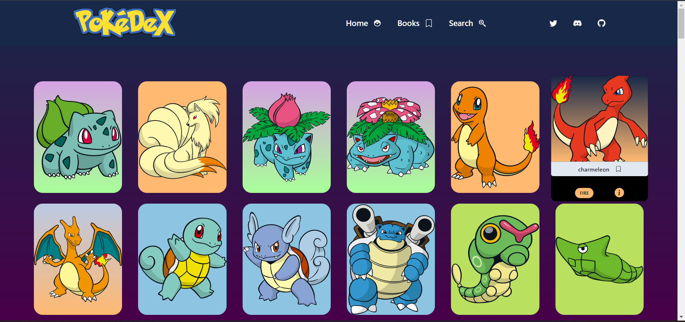
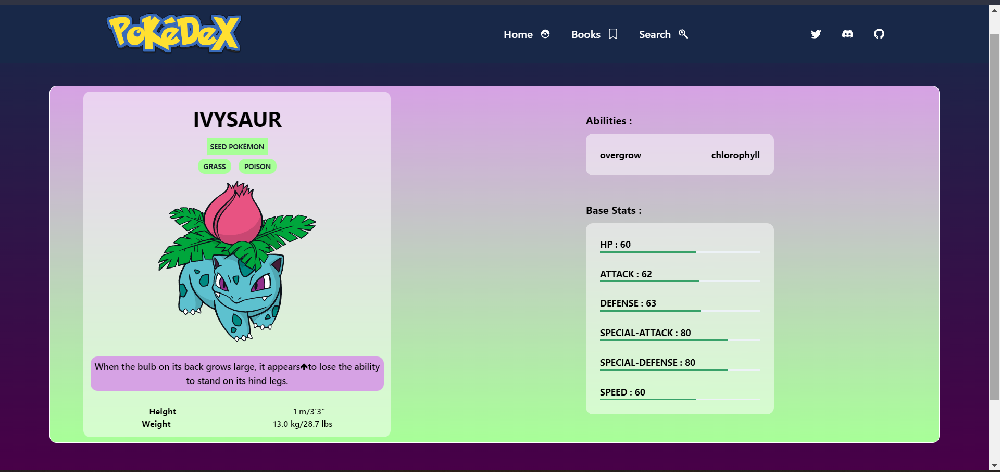

# PokéDex

 A simple Pokémon catalogue, built with [React](https://reactjs.org/), [Chakra-UI](https://chakra-ui.com/) and [PokéAPI](https://pokeapi.co/).

## Links

 Watch it in action [here](https://pokedex-one-lake.vercel.app/)

## Features
- View basic details of each Pokémon
- Sort Pokémon by ID/Name
- Search Pokémon by its Name/ID
- Lazy loading of images
- Responsive design

## Snapshots

Home Page

Details Page

## Built With

- React
- Chakra-UI
- PokéAPI

## Run locally

- Clone this repo
- Run `npm install` and `npm run dev`
- The application opens in `http://localhost:3000/` or any other available port

## To-do
- Include some more Pokémon data - strengths, weaknesses, moves
- Complex evolution chains (Eevee and the likes)
- Add favorites
- Router for Pokemon details

##

Contributions, issues and feature requests are always welcome!
Star the repo if you like this project :) 

